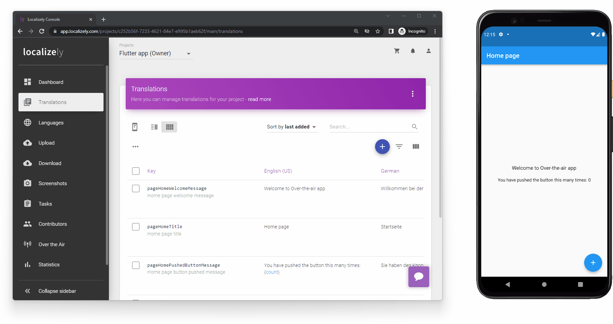

# Flutter “Over the Air” sample app

Flutter sample app with “Over the Air” translation updates

## Setup

- Create new project on Localizely platform and upload ARB files from `lib\l10n` folder
- Create new distribution and SDK token for the created project
- Update `Localizely.init('<SDK_TOKEN>', '<DISTRIBUTION_ID>');` within `lib\main.dart` file with real data from Localizely platform
- Add new release to the created distribution to see translation updates
